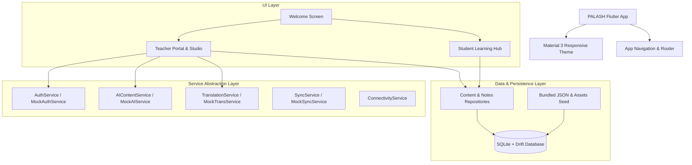

# Implementation Plan - PALASH Mobile Application Prototype

Build a complete, production-quality Flutter mobile application prototype for **PALASH** (*AI-Powered Vernacular Pedagogy and Real-Time Translation Tool for Mother Tongue-Based Primary Education*), focusing on Hindi and Santali bilingual learning for primary-school children and tribal education teachers.

## User Review Required

> [!IMPORTANT]
> - **Offline-First Priority**: The entire student module (Notes, Flashcards, Worksheets, Games, Activities, Stories) will operate completely offline with bundled assets and seeded SQLite (Drift) database.
> - **No Student Authentication**: Students tap "Student" on the welcome screen and enter directly without logins, emails, passwords, or tracking accounts.
> - **Clean Integration Boundaries**: Concrete interfaces (`AuthService`, `AIContentService`, `TranslationService`, `SyncService`) with realistic mock implementations will allow seamless future integration of Firebase Authentication/Firestore, FastAPI backend, and IndicTrans2 without UI rewrites.
> - **Linguistic Verification Markers**: Santali translations are accompanied by clear linguistic TODO markers (`<!-- VERIFIED -->` vs `<!-- TODO: LINGUIST_VERIFICATION -->`) and dual script representations (Devanagari / Ol Chiki / Phonetic Roman).

## Architecture & Tech Stack

---

## Proposed Changes

### 1. Dependencies & Configuration

#### [MODIFY] [pubspec.yaml](file:///c:/Users/Mahavir%20Rawal/Desktop/Palash/Palash-Multilingual-Realtime-Translator/pubspec.yaml)
- Add dependencies:
  - `drift`, `sqlite3_flutter_libs`, `path_provider`, `path`
  - `provider` (state management)
  - `shared_preferences` (persistence of settings, teacher mock session, seed state)
  - `google_fonts` (modern, legible typography)
  - `uuid`, `intl`
- Add dev_dependencies: `drift_dev`, `build_runner`
- Register asset directories: `assets/default_content/data/**`, `assets/default_content/images/**`

---

### 2. Core & Architecture Layer

#### [NEW] `lib/core/constants/app_colors.dart` & `app_styles.dart`
- Palash warm vermilion (`#E64A19`), Forest Green (`#2E7D32`), Saffron Gold (`#F9A825`), Deep Slate (`#1E293B`), Soft Sand (`#FAF8F5`).

#### [NEW] `lib/core/connectivity/connectivity_service.dart`
- Offline / Online state tracker with a simulated offline toggle in debug mode for testing offline persistence.

#### [NEW] `lib/app/theme.dart` & `lib/app/routes.dart` & `lib/app/app.dart`
- Child-friendly rounded Material 3 design, responsive tablet/phone layouts, named routing system.

---

### 3. Database Layer (SQLite + Drift)

#### [NEW] `lib/database/app_database.dart`
- Drift database definition with tables:
  - `FlashcardEntries`: ID, category, subcategory, hindi, santali, santaliOlChiki, imagePath, isDefault, isTeacherCreated, isPublished, createdAt
  - `CurriculumLessons`: ID, gradeClass (1-5), subject (Language, Math, EVS), titleHindi, titleSantali, description
  - `TeacherNotes`: ID, lessonId, gradeClass, subject, title, hindiContent, santaliContent, status (draft/published), createdAt
  - `AIGeneratedContents`: ID, noteId, contentType (explanation, translation, flashcards, worksheet, practice, activities), rawPayloadJson, status (draft/approved/published)
  - `WorksheetQuestions`: ID, worksheetId, titleHindi, titleSantali, imagePath, optionsJson, correctIndex, explanationHindi, explanationSantali
  - `GameItems`: ID, gameType, category, titleHindi, titleSantali, dataJson
  - `StoryEntries`: ID, titleHindi, titleSantali, coverImage, pagesJson
  - `SyncRecords`: ID, entityType, entityId, lastSyncedAt, syncStatus

#### [NEW] `lib/database/daos/`
- `FlashcardDao`, `NotesDao`, `AIDao`, `WorksheetDao`, `GameDao`, `StoryDao`.

#### [NEW] `lib/database/seed_data.dart`
- Automatic first-launch seeder that parses bundled default JSON data and populates SQLite.

---

### 4. Bundled Default Content (`assets/default_content/`)

#### [NEW] `assets/default_content/data/`
- `flashcards/language.json`, `flashcards/math.json`, `flashcards/general_knowledge.json`
- `curriculum/lessons.json`
- `worksheets/worksheets.json`
- `games/games.json`
- `activities/activities.json`
- `stories/stories.json`

#### [NEW] `assets/default_content/images/`
- Custom vector/canvas-rendered and optimized illustrations for animals, fruits, vegetables, colors, classroom, math shapes, family.

---

### 5. Service & Repository Layer (Integration Boundaries)

#### [NEW] `lib/services/auth_service.dart` & `mock_auth_service.dart`
- Authentication interface ready for future Firebase Auth.

#### [NEW] `lib/services/ai_content_service.dart` & `mock_ai_content_service.dart`
- AI generation interface returning lesson explanations, Santali translations, flashcards, worksheets, practice questions, and activities from teacher notes (ready for FastAPI).

#### [NEW] `lib/services/translation_service.dart` & `mock_translation_service.dart`
- Live speech & text translation interface (ready for IndicTrans2).

#### [NEW] `lib/services/sync_service.dart` & `mock_sync_service.dart`
- Future Firebase/backend synchronization interface.

#### [NEW] `lib/repositories/content_repository.dart` & `teacher_repository.dart`
- Repository abstractions wrapping Drift database and services.

---

### 6. Features - Teacher Section

- **Welcome & Auth**: `features/authentication/teacher_login_screen.dart` (Google button, Email/Password, Forgot password, Mock auth validation).
- **Teacher Dashboard**: `features/teacher/dashboard/teacher_dashboard_screen.dart` (Teacher info, stats counters for drafts/published, sync status, quick access modules).
- **Curriculum & Notes**: `features/teacher/curriculum/curriculum_screen.dart`, `lesson_detail_screen.dart`, `add_edit_note_screen.dart`, `upload_note_dialog.dart`.
- **AI Generation Studio**: `features/teacher/ai_generation/ai_generator_screen.dart`, `draft_review_screen.dart` (Draft -> Review -> Edit / Regenerate -> Approve -> Publish).
- **Teacher Flashcard Studio**: `features/teacher/flashcards/teacher_flashcard_screen.dart`, `manual_flashcard_creator.dart`.
- **Live Translation Studio**: `features/teacher/translation/live_translation_screen.dart` (Hindi text & voice input -> Santali translation with microphone recording state, clear/retry, session history, internet requirement disclaimer).
- **Content Review & Settings**: `features/teacher/review/content_review_screen.dart`.

---

### 7. Features - Student Section (100% Offline)

- **Student Home**: `features/student/home/student_home_screen.dart` (Colorful, child-friendly 6 main navigation tiles).
- **Notes Module**: `features/student/notes/student_notes_screen.dart` (Class 1-5 -> Subject -> Lesson with bilingual Hindi + Santali rich display).
- **Flashcards Module**: `features/student/flashcards/student_flashcards_screen.dart` (Language [8 subcategories], Mathematics [6 subcategories], General Knowledge [6 subcategories], flip card animation, image, Hindi + Santali).
- **Worksheets Module**: `features/student/worksheets/student_worksheets_screen.dart` (Interactive question cards, immediate feedback celebration or gentle encouragement with Hindi + Santali explanation, Next / Try Again).
- **Games Module**: `features/student/games/student_games_screen.dart` (Language Match, Letter Match, Sentence Arrange, Count Objects, Math Match, Addition, Shape Match, Memory Card Match, Listen & Choose placeholder).
- **Activities Module**: `features/student/activities/student_activities_screen.dart` (Object identification, Concept match, Drag & Arrange).
- **Stories Module**: `features/student/stories/student_stories_screen.dart` & `story_reader_screen.dart` (Rich illustrated bilingual story reader).

---

## Verification Plan

### Automated Build & Test
- Run `flutter analyze` to ensure zero compile/type errors and clean code.
- Run `flutter test` for database seeder, mock services, and model deserialization.

### Manual End-to-End Simulation
1. **Initial Screen**: Verify "Teacher" and "Student" paths.
2. **Teacher Flow**: Login -> Dashboard -> Curriculum (Class 1-5) -> Note creation -> Send to AI -> AI Generation Draft -> Edit/Regenerate -> Approve -> Publish -> Manual Flashcard Creator -> Live Translation Studio (Voice & Text) -> Logout.
3. **Student Flow**: Direct tap on "Student" -> Notes -> Flashcards (browse all categories) -> Worksheets (test correct and incorrect feedback) -> Games (play Language, Math, Memory) -> Activities -> Stories (flip story pages).
4. **Offline Resilience**: Toggle connectivity to Offline -> Verify all Student features remain 100% functional and responsive from SQLite/Drift.
